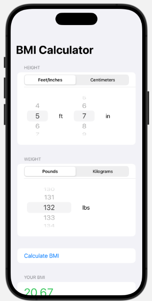
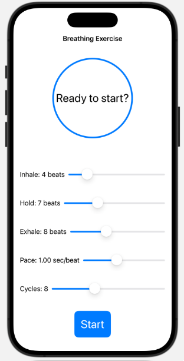

# iOS App: Fitness Tools

## Overview

`ios_app_fitness_tools` is an iOS application designed to assist users in maintaining and improving their health and wellness. The app currently features two core tools:

1. **BMI Calculator**: Allows users to calculate their Body Mass Index (BMI) based on their height and weight.
2. **Breathing Exercise Tool**: Guides users through customizable breathing exercises, aimed at relaxation and mindfulness.

## Tools

### 1. BMI Calculator

The BMI Calculator helps users quickly and accurately calculate their BMI based on input height and weight. The tool supports both the metric (centimeters, kilograms) and imperial (feet, inches, pounds) systems.

- **Inputs**:
  - Height: User can enter their height in either feet/inches or centimeters.
  - Weight: User can choose between pounds or kilograms for their weight input.
- **Functionality**: Upon entering their height and weight, users can calculate their BMI, which will display immediately in the app.


  
### 2. Breathing Exercise Tool

The Breathing Exercise tool provides guided breathing exercises with customizable settings. Users can adjust parameters such as the inhale, hold, and exhale duration, the pace of the breaths, and the number of cycles.

- **Controls**:
  - Inhale duration: Adjust the number of beats for inhaling.
  - Hold duration: Set the duration of the breath hold after inhaling.
  - Exhale duration: Customize the exhale duration.
  - Pace: Adjust the pace in seconds per beat for a slower or faster breathing cycle.
  - Cycles: Set the total number of breathing cycles.
- **Functionality**: Once the user has set their preferred values, they can start the exercise, and the app will guide them through each phase (inhale, hold, exhale) for a calming and mindful experience.



## Installation

To run the `ios_app_fitness_tools` on your device, follow these steps:

1. Clone the repository to your local machine.
   ```bash
   git clone https://github.com/tonylai2022/ios_app_fitness_tools.git
2. Open the project in Xcode.

3. Build and run the app on a simulator or a connected device.
